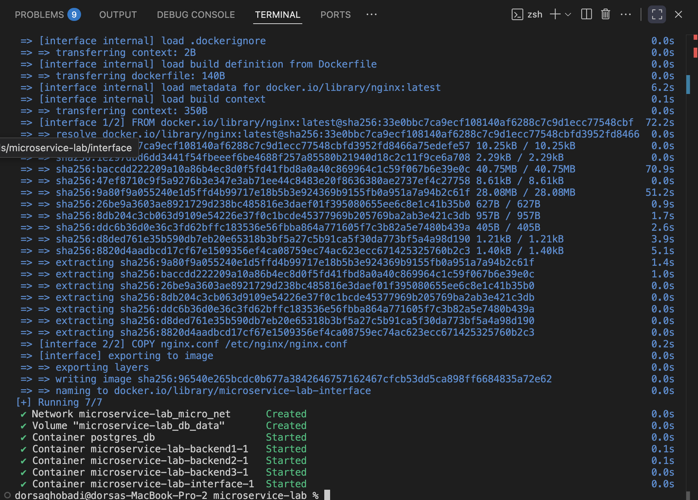
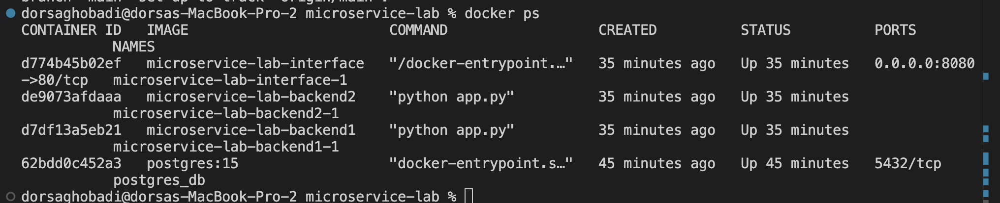
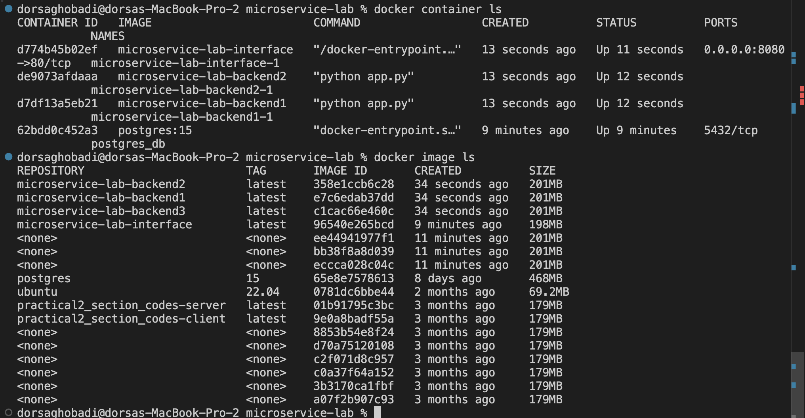
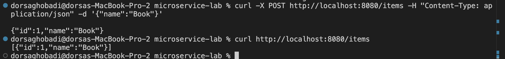

# گزارش پروژه Microservice-Lab

## مقدمه
این پروژه با هدف پیاده‌سازی معماری **Microservice** طراحی شده است که شامل چند سرویس Backend، یک Gateway برای مدیریت درخواست‌ها (Load Balancer)، و یک پایگاه داده مشترک PostgreSQL است. ابزارهای اصلی این پروژه شامل **Docker** و **Docker Compose** هستند تا امکان ساخت، مدیریت و استقرار همه سرویس‌ها به صورت ایزوله و هماهنگ فراهم شود.

---

## ساختار کلی پروژه
ساختار فولدرها و فایل‌ها  به صورت زیر است:

```
microservice-lab/
│
├── docker-compose.yml       
 ( تعریف تمام سرویس‌ها و شبکه‌ها)
│
├── interface/                
 (سرویس Gateway / Load Balancer)
│   ├── Dockerfile
│   └── nginx.conf
│
├── backend/                 
 ( سرویس Backend)
│   ├── Dockerfile
│   ├── requirements.txt
│   └── app.py

```

---

## توضیح اجزای کلیدی

### 1. docker-compose.yml
- وظیفه: تعریف تمام سرویس‌های پروژه، تنظیم وابستگی‌ها (`depends_on`)، و مشخص‌کردن شبکه مشترک.
- سرویس‌ها:
  - **postgres_db**: پایگاه داده PostgreSQL
  - **backend1**, **backend2**, **backend3**: سرویس‌های پردازش درخواست
  - **interface**: دروازه ورودی (Nginx) که ترافیک را بین backendها توزیع می‌کند

---

### 2. Backendها 

در این پروژه سه سرویس با نام‌های microservice-lab-backend1، microservice-lab-backend2 و microservice-lab-backend3 تعریف شده‌اند. هر سه این سرویس‌ها از یک کد واحد استفاده می‌کنند که در پوشه backend قرار دارد.

برای پیاده‌سازی معماری مبتنی بر چند نمونه (Multi‑Instance)، همین پوشه و کد اصلی سه مرتبه برای سرویس‌های مختلف در فایل docker-compose.yml استفاده شده است. با این کار، هر سرویس در کانتینر جداگانه اجرا می‌شود، اما منطق و کد اجرایی آن‌ها یکسان است.
- **Dockerfile**:
  ```dockerfile
  FROM python:3.11-slim
  WORKDIR /app
  COPY requirements.txt .
  RUN pip install --no-cache-dir -r requirements.txt
  COPY . .
  CMD ["python", "app.py"]
  ```
  وظیفه: ساخت ایمیج Python سبک، نصب وابستگی‌ها، کپی کد، و اجرای سرویس.

- **app.py**:
  - استفاده از Flask برای ساخت API REST
  - متصل‌کردن سرویس به پایگاه داده Postgres با SQLAlchemy
  - ارائه endpointهایی مثل:
    - `GET /items`
    - `POST /items`

- **requirements.txt**:
  - لیست پکیج‌ها مثل `flask`, `sqlalchemy`, `psycopg2-binary`

---

### 3. Interface (Nginx)
- **Dockerfile**:
  ```dockerfile
  FROM nginx:1.25-alpine
  COPY nginx.conf /etc/nginx/nginx.conf
  ```

- **nginx.conf**:
  - تعریف upstream با آدرس سرویس‌های backend:
    ```nginx
    upstream backends {
        server backend1:5000;
        server backend2:5000;
        server backend3:5000;
    }
    ```
  - یک سرور که روی پورت 80 گوش می‌دهد و درخواست‌ها را بین backendها پخش می‌کند.

---

### 4. Postgres (postgres_db)
- استفاده از ایمیج رسمی `postgres:15`
- پیکربندی کاربر، پسورد، و نام دیتابیس با متغیرهای محیطی
- اجرای خودکار `init.sql` برای ایجاد جداول داده‌ای اولیه هنگام ساخت اولین‌بار کانتینر

---

## مراحل راه‌اندازی پروژه

1. **ساخت ایمیج‌ها**
   ```bash
   docker compose build
   ```

2. **اجرای سرویس‌ها**
   ```bash
   docker compose up
   ```
 

3. **بررسی وضعیت سرویس‌ها**

    ```bash
    docker ps
    ```
باید تمام سرویس‌ها در حالت `Up` باشند.


   

4. **تست image, container ها**  

- 
    ```bash
    docker container ls
    ```
- 
    ```bash
    docker image ls
    ```

 
---

5. **تست API** 

   - افزودن آیتم:  

     ```bash
     curl -X POST http://localhost:8080/items        -H "Content-Type: application/json"        -d '{"name":"Book"}'
     ```
   - دریافت لیست آیتم‌ها:  
   
     ```bash
     curl http://localhost:8080/items
     ```

 
---

##  افزایش فشار روی Backend 
در این سناریو، فروش شرکت افزایش یافته و درخواست‌های کاربران به سرویس **backend** بیشتر شده است. از آنجا که پایگاه‌داده هنوز می‌تواند این فشار را تحمل کند، تنها نیاز داریم فشار روی backendها را کاهش دهیم. این کار با تغییرات کمینه به شکل زیر انجام می‌شود:

1. **اجرای چندین نمونه از backend**  
   در فایل `docker-compose.yml` چند سرویس backend دیگر تعریف می‌کنیم:
   ```yaml
   services:
     backend4:
       build: ./backend
       ports:
         - "5001:5000"
       depends_on:
         - postgres_db

     backend5:
       build: ./backend
       ports:
         - "5002:5000"
       depends_on:
         - postgres_db

     backend6:
       build: ./backend
       ports:
         - "5003:5000"
       depends_on:
         - postgres_db
   ```

2. **افزودن Load Balancer**  
   در فایل `nginx.conf` آدرس همه backendها معرفی شده و درخواست‌ها بین آن‌ها به‌صورت round-robin توزیع می‌شوند:
   ```nginx
   upstream backend_servers {
       server backend1:5000;
       server backend2:5000;
       server backend3:5000;
   }

   server {
       listen 80;

       location / {
           proxy_pass http://backend_servers;
       }
   }
   ```
 **بدون تغییر در کد اصلی backend**  
   چون همه backendها از یک پوشه و یک Image ساخته می‌شوند، نیاز به تغییر در منطق برنامه نیست. تنها افزودن سرویس‌ها و پیکربندی Nginx کافی است.


## جمع‌بندی
این پروژه با ترکیب چند سرویس Backend، یک سرویس Gateway و یک پایگاه داده مشترک، نمونه‌ای عملی از معماری Microservice ارائه می‌دهد. استفاده از Docker و Docker Compose باعث شده است که تمام اجزا در محیط ایزوله خود اجرا شوند و به سادگی قابل اجرا و مقیاس‌پذیری باشند.

## پرسش ها

### مفهوم Stateless و کاربرد آن در آزمایش
تعریف Stateless 

یک سرویس Stateless هیچ اطلاعاتی از وضعیت یا جلسه (Session) درخواست‌های قبل کاربر را در خود نگه نمی‌دارد.
هر درخواست به‌طور مستقل پردازش می‌شود و تمام داده‌های لازم باید به‌صورت صریح (در بدنه یا پارامترها یا توکن احراز هویت) ارسال شوند.
سرویس‌های Stateless به راحتی مقیاس‌پذیرند (Scaling) چرا که نیاز به همسان‌سازی state بین چند سرور وجود ندارد.
### کاربرد در این آزمایش
هر یک از backendها ماژول‌های مستقل هستند که حالت (state) پردازش درخواست‌ها را در خود نگه نمی‌دارند.
ذخیره‌سازی داده‌ها در Postgres انجام می‌شود، نه در حافظه داخلی سرویس.
این باعث شد که بتوانیم با Nginx بار را بین چند backend تقسیم کنیم (Load Balancing) بدون آن که نگران session sync بین آنها باشیم.
در عمل، اگر کاربر درخواست POST یا GET بفرستد، هر backend می‌تواند پاسخ دهد چون همه به یک دیتابیس مشترک وصل‌اند.